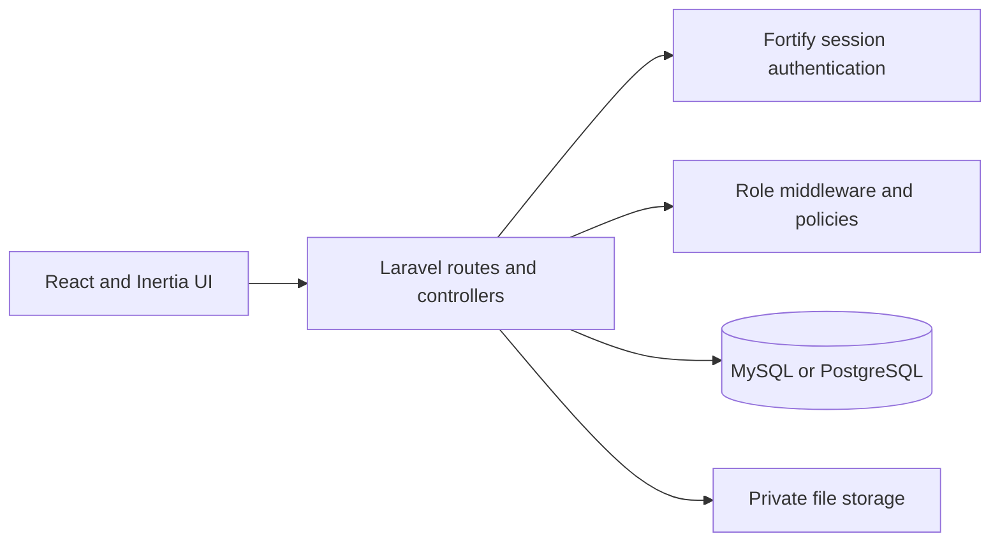

# Internal Document Portal

A secure, role-based document portal built for the Internal Document Portal technical assessment. Employees can organize documents into folders, share access, search, and download files. Administrators can manage accounts and review system activity.

## Contents

- [Project overview](#project-overview)
- [Technology stack](#technology-stack)
- [Features](#features)
- [Roles and permissions](#roles-and-permissions)
- [Getting started](#getting-started)
- [Demo accounts](#demo-accounts)
- [Application routes](#application-routes)
- [Data model and design decisions](#data-model-and-design-decisions)
- [Validation and limitations](#validation-and-limitations)
- [Quality checks](#quality-checks)

## Project overview

The application uses Laravel to handle authentication, authorization, validation, database access, and file storage. React pages are rendered through Inertia.js, so the frontend and backend run as one Laravel application and share a session. Authenticated JSON endpoints are also provided for folder and document operations.



## Technology stack

| Area | Technology |
| --- | --- |
| Backend | PHP 8.3+, Laravel 13 |
| Frontend | React 19, TypeScript, Inertia.js 3 |
| Styling and components | Tailwind CSS 4, Radix UI |
| Build tooling | Vite 8, Laravel Wayfinder |
| Authentication | Laravel Fortify and session cookies |
| Database | PostgreSQL recommended; assessment accepts MySQL or PostgreSQL |
| File storage | Laravel private local disk (`storage/app/private`) |

> **Database note:** The provided `.env.example` defaults to SQLite for a quick local start. The assessment requires MySQL or PostgreSQL. PostgreSQL is recommended because the current search queries use `ILIKE`.

## Features

- Sign in and sign out, account settings, email verification, and password reset.
- Admin and regular-user roles with active/inactive account status.
- User account creation, editing, and deactivation by administrators.
- Folder creation, editing, deletion, and sharing with view or edit access.
- Document upload, metadata updates, soft deletion, private downloads, and PDF/image previews.
- Numbered document versions with uploader, timestamp, checksum, and prior-version downloads.
- Document search by title or original filename, with folder and file-type filters, sorting, and pagination.
- Role-specific dashboards and an administrator activity log.
- Activity records for authentication, folder/document changes, sharing, downloads, and previews where implemented.

## Roles and permissions

| Capability | Admin | Folder owner | Shared user: view | Shared user: edit |
| --- | --- | --- | --- | --- |
| View folders and documents | All | Owned | Shared | Shared |
| Download and preview documents | Yes | Yes | Yes | Yes |
| Upload, update, version, or delete documents | Yes | Yes | No | Yes |
| Edit or delete folder | Yes | Yes | No | No |
| Manage folder sharing | Yes | Yes | No | No |
| Manage user accounts | Yes | No | No | No |
| View global activity log | Yes | No | No | No |

Regular users can create folders. They can access folders they own or that have been shared with them. Inactive accounts are denied access. Document listings, searches, direct links, previews, and downloads are restricted by server-side authorization policies.

## Getting started

### Requirements

- PHP 8.3 or newer and Composer
- Node.js and npm
- PostgreSQL for the recommended setup, or MySQL with the search-query limitation described below
- PHP extensions required by Laravel and the selected database driver

### 1. Install dependencies

```bash
composer install
npm install
```

### 2. Configure the environment

```bash
cp .env.example .env
php artisan key:generate
```

Create an empty PostgreSQL database, then set its connection details in `.env`:

```dotenv
DB_CONNECTION=pgsql
DB_HOST=127.0.0.1
DB_PORT=5432
DB_DATABASE=idoc_portal
DB_USERNAME=postgres
DB_PASSWORD=your-local-database-password
```

Replace the example database name, user, and password with your local values. For MySQL, set `DB_CONNECTION=mysql` and provide the corresponding host, port, database, and credentials. Never use the example credentials in a deployed environment.

### 3. Migrate and seed the demo accounts

```bash
php artisan migrate
php artisan db:seed --class=AdminUserSeeder
```

`AdminUserSeeder` creates the admin and regular demo accounts below. The seeder upserts the admin, but inserts the regular user, so run it once on a fresh database. It does not create folders or documents.

### 4. Run the application

Run the Laravel development stack from the project root:

```bash
composer run dev
```

This project command starts the Laravel server, queue listener, log viewer, and Vite frontend dev server together. Keep this terminal running while you use the application.

Open [http://localhost:8000](http://localhost:8000). You do not need to start `npm run dev` separately when using `composer run dev`; Laravel's React starter kit runs Vite as part of that combined development command. For a production asset build, run `npm run build` and serve Laravel using your chosen PHP web server.

The `composer run setup` script can install dependencies, generate the application key, run migrations, install frontend packages, and build assets. Configure and create the database before running it, then seed the demo accounts with the command above.

## Demo accounts

These dummy credentials are for local evaluation only. Do not reuse them in a deployed environment.

| Role | Sign-in page | Email | Password |
| --- | --- | --- | --- |
| Administrator | `/admin/login` | `admin@example.com` | `password` |
| Regular user | `/login` | `john@example.com` | `password` |

The admin account is seeded as email-verified. The regular demo account is active but not marked verified; the dashboard and portal routes do not require the `verified` middleware. Both accounts use the same Laravel session authentication.

After signing in, the regular dashboard is available at `/dashboard`, the admin dashboard at `/admin/dashboard`, and document management at `/portal`. Create a folder and upload a file to explore the workflow.

The default `php artisan db:seed` command also creates `Test User` (`test@example.com`, password `password`) as a regular user. This account is optional and is not created by `AdminUserSeeder`.

## Application routes

### Web interface

| Path | Description | Access |
| --- | --- | --- |
| `/login` | Regular user sign-in | Guest |
| `/admin/login` | Admin sign-in page | Guest |
| `/dashboard` | Regular user dashboard | Active user role |
| `/admin/dashboard` | Admin dashboard | Active admin role |
| `/admin/users` | User account management | Active admin role |
| `/admin/activity-logs` | Global activity history | Active admin role |
| `/portal` | Folder and document portal | Active admin or user role |

### Authenticated folder and document endpoints

These routes are defined in `routes/api.php` and included by the web route file. They are served at the paths shown below, without an `/api` prefix. They use session authentication rather than bearer tokens; state-changing requests require CSRF protection.

| Method | Path | Description |
| --- | --- | --- |
| `GET`, `POST` | `/folders` | List accessible folders or create a folder |
| `GET`, `PUT`, `DELETE` | `/folders/{folder}` | Read or manage a folder, subject to policy |
| `POST`, `DELETE` | `/folders/{folder}/share`, `/folders/{folder}/share/{user}` | Share or revoke folder access |
| `GET`, `POST` | `/folders/{folder}/documents` | List or upload folder documents |
| `GET`, `PUT`, `DELETE` | `/documents/{document}` | Read or manage a document |
| `GET` | `/documents/{document}/download` | Download the current version |
| `POST` | `/documents/{document}/versions` | Upload a new version |
| `GET` | `/activity-logs` | Admin activity-log page; returns Inertia, not JSON |

The JSON endpoints return resources or message/data objects. List endpoints are paginated. Laravel validation and authorization errors use framework responses. The activity-log route returns an Inertia page response rather than JSON.

## Data model and design decisions

- **Users:** Store a role (`admin` or `user`) and active status. Roles are represented by a PHP enum.
- **Folders:** Belong to a creator. The `folder_user` pivot records shared users and their `view` or `edit` access level.
- **Documents:** Belong to a folder and uploader. Normal document deletion is soft deletion.
- **Document versions:** Each version stores its original filename, private storage path, MIME type, size, SHA-256 checksum, uploader, and version number. A document references its current version. A database transaction and row lock allocate the next version number.
- **Activity logs:** Store the actor, action, optional polymorphic subject, description, metadata, IP address, and timestamp. Admins see global activity; regular users see their own recent activity on the dashboard.
- **Files:** Stored on Laravel's private local disk and delivered through authorized controller actions, not public URLs.
- **Search and pagination:** Results are permission-scoped and paginated. Search uses substring matching; there is no dedicated full-text search service.
- **Database constraints:** Migrations define foreign keys, unique constraints, and indexes for common role, folder, document, version, and activity lookups.

## Validation and limitations

- The Inertia upload and version workflows accept PDF, DOC/DOCX, XLS/XLSX, PPT/PPTX, TXT, CSV, PNG, JPG, and JPEG files up to 50 MB. Preview is limited to PDF and common JPEG/PNG images.
- The JSON upload validators currently enforce a file and the 50 MB limit but do not apply the same file-type allowlist as the Inertia workflows.
- Document and admin user search use PostgreSQL `ILIKE`; these queries need adapting before using MySQL or SQLite. PostgreSQL is the recommended database for evaluation.
- Authorization is folder based; there are no per-document shares or nested folders. There is no bulk operation, full-text index, or user-delete screen.
- Deleting a folder in the portal permanently removes its documents and stored versions. Deleting an individual document uses soft deletion.
- Demo seeding is intentionally small. No sample company files, production user import, or external identity provider are configured.
- This implementation uses local private storage and cookie/session authentication. A production deployment should configure HTTPS, secure cookie settings, backups, and operational monitoring.

## Quality checks

Run the PHP test suite with:

```bash
php artisan test
```

Other available project checks:

```bash
composer run lint:check
composer run types:check
npm run check
npm run types:check
```
